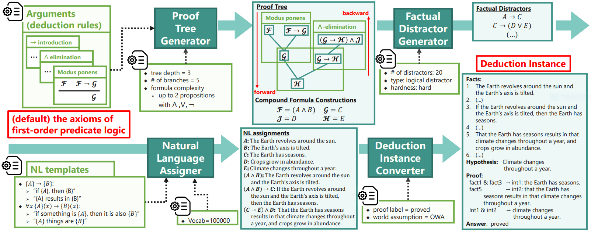

# Formal Logic Deduction


**F**ormal **L**ogic **D**eduction (**FLD**) is a project to teach language models deductive reasoning using synthetically generated examples based on formal logic theory.

## What's Good?
FLD serves as ...

* 🎓 **A foundation for learning logical reasoning**. FLD corpus teaches *fundamentals* of logic, as it adopts a well-grounded set of deduction rules based on formal logic theory.
* 👊 **A challenging benchmark** of logical reasoning, as a fully fine-tuned T5 language model cannot solve *even half* of the problems from the most difficult variant of FLD corpora.
* 🚀 **A basis for future experimental studies**, as it includes several toolkits as follows:
    - the corpora easily used via [the huggingface hub](https://huggingface.co/datasets/hitachi-nlp/FLD.v2).
    - [a simple training script](https://github.com/hitachi-nlp/FLD-prover/), which is a minimal adaptation of transformer's script.
    - [the flexible corpus generator](https://github.com/hitachi-nlp/FLD-generator/), with which one can generate one's own corpus with desired settings.

See [our paper](https://proceedings.mlr.press/v202/morishita23a.html) *Learning Deductive Reasoning from Synthetic Corpus based on Formal Logic (ICML2023)* for details.

## Contents
* [Using the released FLD corpora](https://github.com/hitachi-nlp/FLD-corpus).
* [Train a prover on the corpora](https://github.com/hitachi-nlp/FLD-prover/).
* [Generating new corpora](https://github.com/hitachi-nlp/FLD-generator/).

## Contact
For any reason where a GitHub pull request or an issue is not appropriate, feel free to email terufumi.morishita.wp[at]hitachi.com.

## Citation
```bibtex
@InProceedings{pmlr-v202-morishita23a,
  title = 	 {Learning Deductive Reasoning from Synthetic Corpus based on Formal Logic},
  author =       {Morishita, Terufumi and Morio, Gaku and Yamaguchi, Atsuki and Sogawa, Yasuhiro},
  booktitle = 	 {Proceedings of the 40th International Conference on Machine Learning},
  pages = 	 {25254--25274},
  year = 	 {2023},
  editor = 	 {Krause, Andreas and Brunskill, Emma and Cho, Kyunghyun and Engelhardt, Barbara and Sabato, Sivan and Scarlett, Jonathan},
  volume = 	 {202},
  series = 	 {Proceedings of Machine Learning Research},
  month = 	 {23--29 Jul},
  publisher =    {PMLR},
  pdf = 	 {https://proceedings.mlr.press/v202/morishita23a/morishita23a.pdf},
  url = 	 {https://proceedings.mlr.press/v202/morishita23a.html},
  abstract = 	 {We study a synthetic corpus based approach for language models (LMs) to acquire logical deductive reasoning ability. The previous studies generated deduction examples using specific sets of deduction rules. However, these rules were limited or otherwise arbitrary. This can limit the generalizability of acquired deductive reasoning ability. We rethink this and adopt a well-grounded set of deduction rules based on formal logic theory, which can derive any other deduction rules when combined in a multistep way. We empirically verify that LMs trained on the proposed corpora, which we name $\textbf{FLD}$ ($\textbf{F}$ormal $\textbf{L}$ogic $\textbf{D}$eduction), acquire more generalizable deductive reasoning ability. Furthermore, we identify the aspects of deductive reasoning ability on which deduction corpora can enhance LMs and those on which they cannot. Finally, on the basis of these results, we discuss the future directions for applying deduction corpora or other approaches for each aspect. We release the code, data, and models.}
}
```
