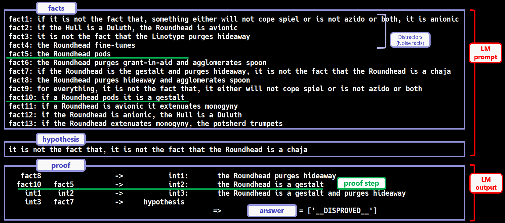

# Formal Logic Deduction


**F**ormal **L**ogic **D**eduction (**FLD**) is a project to teach language models deductive reasoning using synthetically generated examples based on formal logic theory.
FLD project originates from the paper [Learning Deductive Reasoning from Synthetic Corpus based on Formal Logic](https://arxiv.org/abs/2308.07336) (ICML2023).

## News
We have released a Japanese logical benchmark, **JFLD** (**Ja**panese **Fo**rmal **Lo**gic **D**eduction).
See [here](https://github.com/hitachi-nlp/FLD-corpus/blob/main/README.JFLD.md).

## What's good?
FLD serves as ...

* 👊 **A Challenging Benchmark for Logical Reasoning**: FLD assesses (i) pure reasoning *isolated from knowledge*, and (ii) diverse reasoning patterns. Indeed, even GPT-4 can solve only about half of the problems.
* 🎓 **A Foundation for Learning Logical Reasoning**: The FLD corpus teaches the **fundamentals** of logic, adopting a well-grounded set of atomic deduction rules based on formal logic theory.
* 🚀 **A Basis for Future Experimental Studies**: It encompasses several toolkits as listed below, paving the way for innovative research.

## Contents
* You can use the corpora via 🤗 huggingface hub. See [here](https://github.com/hitachi-nlp/FLD-corpus).
* You can evaluate various LLMs, such as GPT-4 and Llama, by using [lm-evlauation-harness](https://github.com/EleutherAI/lm-evaluation-harness/tree/main/lm_eval/tasks/fld) or [our evaluation scripts](https://github.com/hitachi-nlp/FLD-fewshot-ICL-eval).
* You can fine-tune language models on FLD corpora. You can either use a logical-reasoning framework [LogiTorch/logitorch](https://github.com/LogiTorch/logitorch), or [our training scripts](https://github.com/hitachi-nlp/FLD-prover/).
* You can generate corpora with your own setting using [our corpus generator](https://github.com/hitachi-nlp/FLD-generator/).

## Other materials (Japanese only)
* [日経ロボティクス2024/1月号: 言語モデルの論理推論能力を大きく改善、日立が学習用コーパスの自動生成技術](https://xtech.nikkei.com/atcl/nxt/mag/rob/18/012600001/00136)
* [人工知能学会2023: 人工演繹推論コーパスによる学習は言語モデルをどのように強化するか？](https://www.jstage.jst.go.jp/article/pjsai/JSAI2023/0/JSAI2023_2E5GS605/_pdf)
* [言語処理学会2023: 形式論理学に基づく演繹コーパスによる言語モデルに対する演繹推論能力の付与](https://www.anlp.jp/proceedings/annual_meeting/2023/pdf_dir/B1-2.pdf)

## Contact
For any reason where a GitHub pull request or an issue is not appropriate, feel free to email terufumi.morishita.wp[at]hitachi.com.

## Citation
```bibtex
@InProceedings{pmlr-v202-morishita23a,
  title = 	 {Learning Deductive Reasoning from Synthetic Corpus based on Formal Logic},
  author =       {Morishita, Terufumi and Morio, Gaku and Yamaguchi, Atsuki and Sogawa, Yasuhiro},
  booktitle = 	 {Proceedings of the 40th International Conference on Machine Learning},
  pages = 	 {25254--25274},
  year = 	 {2023},
  editor = 	 {Krause, Andreas and Brunskill, Emma and Cho, Kyunghyun and Engelhardt, Barbara and Sabato, Sivan and Scarlett, Jonathan},
  volume = 	 {202},
  series = 	 {Proceedings of Machine Learning Research},
  month = 	 {23--29 Jul},
  publisher =    {PMLR},
  pdf = 	 {https://proceedings.mlr.press/v202/morishita23a/morishita23a.pdf},
  url = 	 {https://proceedings.mlr.press/v202/morishita23a.html},
}
```
