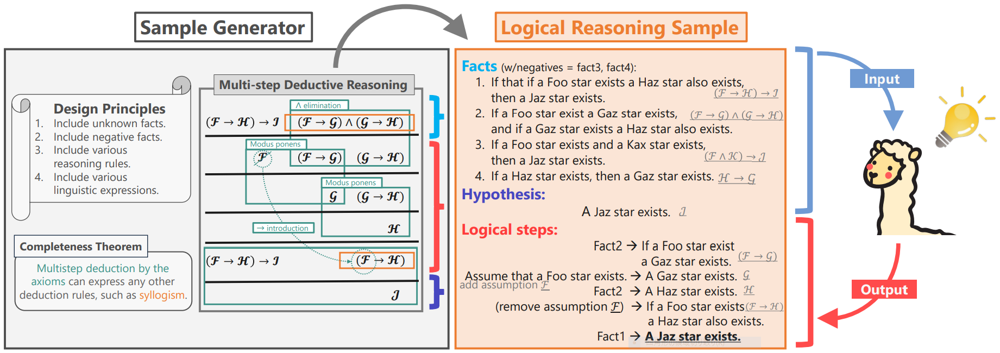
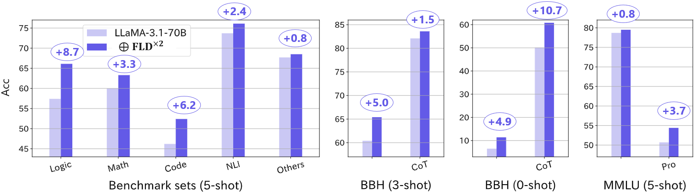

# Formal Logic Deduction


**F**ormal **L**ogic **D**eduction (**FLD**) is a project to enhance LLMs' reasoning capabilities via synthetically generated samples of logical reasoning, the most fundamental form of reasoning.

## [!] Latest Updates
🎉 **A new paper at NeurIPS 2024, [Enhancing Reasoning Capabilities of LLMs via Principled Synthetic Logic Corpus](https://arxiv.org/abs/2411.12498).**  

💎 **Released [FLDx2 (Formal Logic Deduction Diverse)](https://huggingface.co/datasets/hitachi-nlp/FLDx2), our most advanced corpus that substantially improves reasoning capabilities of state-of-the-art LLMs**


## Key Features

🎓 Built on **well-grounded design principles**, which integrate symbolic logic theory and previous empirical insights, resulting in diverse samples covering (i) multi-step deduction with unknown facts, (ii) diverse reasoning rules, (iii) diverse linguistic expressions, and (iv) challenging distractors.

🚀 Demonstrates substantial enhancement in LLM reasoning capabilities.

👊 Serves as a challenging benchmark asessing pure reasoning capabilities isolated from knowledge. Even GPT-4 can solve only about half of the problems.

## Contents
* Released Resources
    * FLD corpora are detailed [here](https://github.com/hitachi-nlp/FLD-corpus).
    * LLMs trained on FLDx2: [LLaMA-3.1-8B](https://huggingface.co/hitachi-nlp/Llama-3.1-8B-FLDx2) and [LLaMA-3.1-70B](https://huggingface.co/hitachi-nlp/Llama-3.1-70B-FLDx2) (only for a single seed).
* Training LLMs on FLD corpora by [our scripts](https://github.com/hitachi-nlp/FLD-prover/).
* Evaluation:
    * Evaluating the LLMs on reasoning-related benchmarks, as done in our paper, by using [our fork of lm-evaluation-harness](https://github.com/hitachi-nlp/lm-evaluation-harness) and [our fork of bigcode-evaluation-harness](https://github.com/hitachi-nlp/bigcode-evaluation-harness).
    * Evaluating LLMs on FLD itself using [the official lm-evlauation-harness](https://github.com/EleutherAI/lm-evaluation-harness/tree/main/lm_eval/tasks/fld) (recommended), or [our evaluation scripts](https://github.com/hitachi-nlp/FLD-fewshot-ICL-eval).
* Generating FLD corpora by [our generator](https://github.com/hitachi-nlp/FLD-generator/).

## Publications

### International Coneferences
* ["Enhancing Reasoning Capabilities of LLMs via Principled Synthetic Logic Corpus", NeurIPS, 2024](https://arxiv.org/abs/2411.12498)
* ["JFLD: A Japanese Benchmark for Deductive Reasoning Based on Formal Logic", LREC-COLING, 2024](https://aclanthology.org/2024.lrec-main.832/)
* ["Learning Deductive Reasoning from Synthetic Corpus based on Formal Logic", ICML, 2023](https://arxiv.org/abs/2308.07336)

### Domestic Conferences (Japanese only)
* [「帰納的に多様な巨大論理推論コーパスによりLLMの汎用論理推論能力を向上させる」, 人工知能学会, 2024](https://confit.atlas.jp/guide/event-img/jsai2024/3Xin2-64/public/pdf?type=in)
* [「日本語論理推論ベンチマークJFLDの提案」, 言語処理学会, 2024](https://www.anlp.jp/proceedings/annual_meeting/2024/pdf_dir/A4-1.pdf)
* [「言語モデルの論理推論能力を大きく改善、日立が学習用コーパスの自動生成技術」, 日経ロボティクス, 2024/01](https://xtech.nikkei.com/atcl/nxt/mag/rob/18/012600001/00136)
* [「人工演繹推論コーパスによる学習は言語モデルをどのように強化するか？」, 人工知能学会, 2023](https://www.jstage.jst.go.jp/article/pjsai/JSAI2023/0/JSAI2023_2E5GS605/_pdf)
* [「形式論理学に基づく演繹コーパスによる言語モデルに対する演繹推論能力の付与」, 言語処理学会, 2023](https://www.anlp.jp/proceedings/annual_meeting/2023/pdf_dir/B1-2.pdf)

## Contact
For any reason where a GitHub pull request or an issue is not appropriate, feel free to email terufumi.morishita.wp[at]hitachi.com.

## Citation
If you liked our project, please consider citing the following papers:
```bibtex
@inproceedings{morishita_2024_NeurIPS_FLD_diverse,
  title={Enhancing Reasoning Capabilities of LLMs via Principled Synthetic Logic Corpus}, 
  author={Terufumi Morishita and Gaku Morio and Atsuki Yamaguchi and Yasuhiro Sogawa},
  booktitle={Annual Conference on Neural Information Processing Systems},
  year={2024}
}

@inproceedings{morishita2024jfld,
  title = {JFLD: A Japanese Benchmark for Deductive Reasoning based on Formal Logic},
  author = {Morishita, Terufumi and Yamaguchi, Atsuki and Morio, Gaku and Hikaru, Tomonari and Osamu Imaichi and Sogawa, Yasuhiro},
  booktitle = {Proceedings of the Joint International Conference on Computational Linguistics, Language Resources and Evaluation},
  year = {2024}
}

@inproceedings{morishita2023fld,
  title = {Learning Deductive Reasoning from Synthetic Corpus based on Formal Logic},
  author = {Morishita, Terufumi and Morio, Gaku and Yamaguchi, Atsuki and Sogawa, Yasuhiro},
  booktitle = {Proceedings of the 40th International Conference on Machine Learning},
  year = {2023}
}
```
